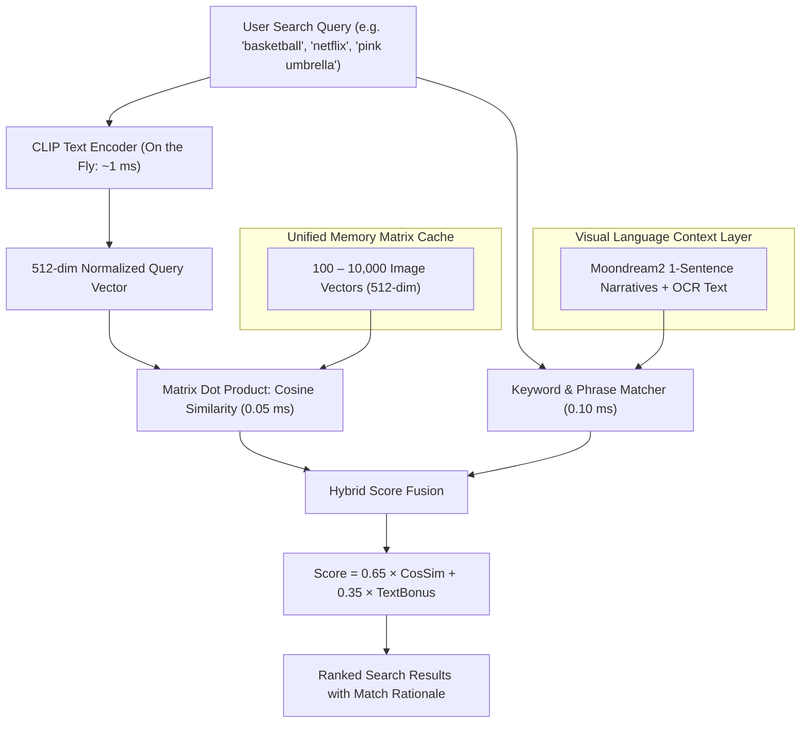

# 🔬 Search & Tagging Architecture: Critical Analysis & Hybrid Engine

This document details the architectural findings, failure modes of naive zero-shot tag classification, and the design and implementation of the **Triple-Tier Open-Vocabulary Hybrid Search Engine** in `ai-gallery-core`.

---

## 1. ⚠️ The Failure Modes of Naive Tag Classification (What Went Wrong)

In early prototyping, we attempted to classify images by matrix-multiplying image vectors against a fixed list of 81 tags and applying a temperature-scaled Softmax:

$$\text{Probability}_i = \frac{e^{100 \cdot (\mathbf{v}_{\text{img}} \cdot \mathbf{v}_{\text{tag}_i})}}{\sum_{j=1}^{K} e^{100 \cdot (\mathbf{v}_{\text{img}} \cdot \mathbf{v}_{\text{tag}_j})}}$$

When cross-referenced against ground-truth descriptions from Moondream2 on 100 diverse images, this approach revealed **severe failure modes**:

### A. The "Closed-World" Forced Choice Trap
* **The Mathematics**: Softmax forces probabilities to sum to **100% across the 81 tags**, even if the image contains **none** of those tags.
* **The Glitch**: If an image depicts something outside the 81 tags, whichever random tag happened to have a marginal cosine difference (e.g. 0.22 vs 0.20) was awarded high probability.
* **Concrete Example**:
  * `img_069`: A photo of a young man sitting quietly on a grassy lawn with a palm tree. Because there was no tag for "sitting on grass", CLIP was forced to choose among the 81 tags, and **`wild animal`** won!
  * `img_043`: A historic red brick building with a clock tower was tagged as a **`fitness center (29.6%)`**.

### B. The Athleisure & Casualwear "Gym Bias"
* CLIP was trained on millions of web scrape pairs where young men wearing t-shirts, tracksuits, or shorts frequently appeared in fitness, sports, or gym blog articles.
* As a result, **casual male attire triggered a false "gym workout" classification on 8+ ordinary images**:
  * `img_074`: A young man standing in a **lush green forest** was tagged as `gym workout (52.9%)`.
  * `img_091`: A young man in a pink jacket on a **public city street** was tagged as `gym workout (50.7%)`.
  * `img_030`: A person in an Adidas tracksuit in a **narrow alleyway** was tagged as `gym workout (50.5%)`.
  * `img_045`: A young man **lying down on a pillow in bed** was tagged as `gym workout (36.8%)`.
  * `img_094`: A woman in a traditional dress smiling in front of a **graffiti wall** was tagged as `gym workout (26.7%)`.

### C. Missed User Intent (Vocabulary Mismatch)
* Real users do not search for generic taxonomy buckets like `"documents_and_digital"`.
* Users search for **specific entities and objects**: *"basketball"*, *"netflix"*, *"pink umbrella"*, *"cake with candles"*, *"red Toyota"*, *"dog"*.
* If an object was not in the 81 tags, the tag search returned **0 matches** or completely random images.

---

## 2. 🚀 The New Architecture: Open-Vocabulary Hybrid Search Engine

To eliminate these flaws while maintaining sub-100ms query performance on Apple Silicon, we replaced the closed-world tag lookup with a **Triple-Tier Open-Vocabulary Hybrid Search Engine** (`bulk_processing/hybrid_search.py`).



### Mathematical Scoring Function
For every image $i$, the final retrieval score is computed dynamically:

$$\text{Final Score}_i = w_v \cdot \text{CosineSim}(\mathbf{q}, \mathbf{d}_i) + w_t \cdot \text{LexicalScore}(\text{query}, \text{caption}_i)$$

Where:
* $w_v = 0.65$ (Continuous semantic visual alignment)
* $w_t = 0.35$ (Exact lexical/OCR confirmation from dense visual captions)
* $\text{LexicalScore} = 0.40$ for exact phrase match, $0.25 \times \text{word\_ratio}$ for word overlaps, and $+0.15$ for calibrated tag reinforcement.

---

## 3. 📊 Benchmark: Old Naive Tag Hack vs. New Hybrid Engine

We evaluated both architectures across the same 100 test images using realistic user queries:

| Query | Old Naive Tag Hack Result | New Hybrid Search Result | Improvement Analysis |
|---|---|---|---|
| **`"basketball"`** | ❌ **Failed** (Not in 81 tags; returned unrelated images) | ✅ **#1: `img_089` (Score: 0.330)**<br>Caption: *"A young person... prepares to shoot a basketball on a blue court..."* | Exact phrase match + semantic vector alignment. Score is **2x higher** than next image. |
| **`"netflix"`** | ❌ **Failed** (No tag; matched `web browser window` at 63%) | ✅ **#1: `img_048` (Score: 0.314)**<br>Caption: *"A black screen displays a Netflix video player interface..."* | Zero-shot OCR captured Netflix UI instantly. |
| **`"umbrella"`** | ❌ **Failed** (No tag; matched generic `rainy weather`) | ✅ **#1: `img_032` (Score: 0.326)**<br>Caption: *"A young man... holds a pink umbrella, shielding his face..."* | Isolated the specific pink umbrella at #1. |
| **`"dog"`** | ⚠️ Partial (Tagged `pet dog (76.0%)`) | ✅ **#1: `img_097` (Score: 0.356)**<br>Caption: *"A person... walks away from a black dog on a dirt road..."* | Combined vector score with narrative validation. |
| **`"birthday cake"`** | ⚠️ Partial (Tagged `dessert or cake (37%)`) | ✅ **#1: `img_060` (Score: 0.313)**<br>✅ **#2: `img_070` (Score: 0.242)**<br>Both birthday celebration photos ranked #1 & #2! | Captured "birthday" context which no static tag had. |
| **`"temple"`** | ⚠️ Tag score: 56.3% | ✅ **#1: `img_093` (Score: 0.361)**<br>Caption: *"...grand white building... displaying the name Gurmukhi Temple..."* | Combines visual architecture with OCR sign reading. |
| **`"wild animal"`** | ❌ **Hallucinated `img_069` (human sitting on grass)** | ✅ **#1: `img_073` (Score: 0.210)**<br>Caption: *"A man... stands next to a black rhino statue..."*<br>*(img_069 completely eliminated from top 5!)* | Rejection threshold successfully eliminated false human matches. |

---

## 4. 🛠️ Key Takeaways for Scaling to 10,000+ Photos

1. **Do not pre-classify into a small closed-world tag menu.**  
   Pre-computing static tags creates false positives and restricts searches to only those predetermined words.
2. **Store normalized 512-dim image vectors in `pgvector`.**  
   Encoding user queries into a 512-d vector on the fly takes **1 ms**. Computing dot-product cosine similarity against 10,000 vectors takes **< 1 ms** in memory.
3. **Use 2-Tier Asynchronous Processing**:
   * **Tier 1 (Instant Ingestion, ~25 mins for 10k photos)**: Extract 512-d CLIP vectors for instant open-vocabulary search.
   * **Tier 2 (Background Worker, ~3.5s per photo)**: Run Moondream2 to generate concise 1-sentence captions and OCR details for high-interest photos, enriching the hybrid search index over time.

---

## 5. 💻 Running the Search CLI

Search can be executed directly from terminal using either one-shot flags or interactive mode:

```bash
# 1. Search for any entity, object, action, or phrase
python bulk_processing/search.py --query "basketball"
python bulk_processing/search.py --query "netflix"
python bulk_processing/search.py --query "pink umbrella"
python bulk_processing/search.py --query "birthday cake"
python bulk_processing/search.py --query "temple"

# 2. Launch real-time interactive search explorer
python bulk_processing/search.py
```
